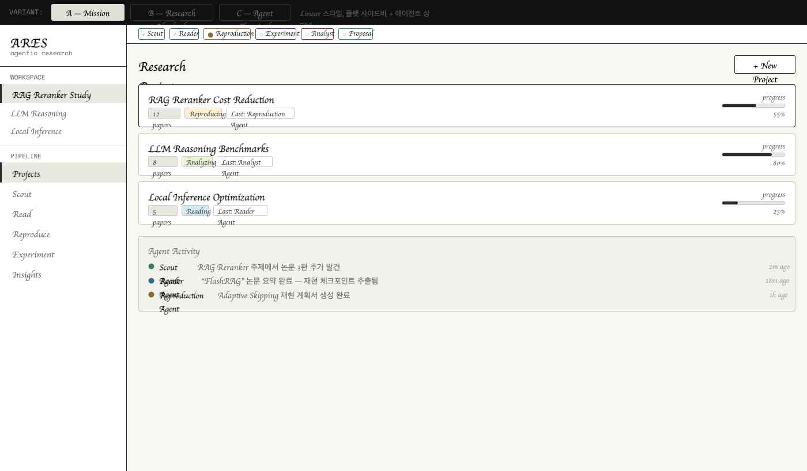

# ARES

**Agentic Research Experimentation System**

연구 아이디어를 논문 탐색에서 끝내지 않고, 재현, 실험, 인사이트, 문서화까지 이어지게 만드는 에이전트 기반 연구 실행 워크스페이스



## Overview

ARES는 AI/ML 연구자가 다음 흐름을 하나의 연속된 작업 공간에서 수행할 수 있도록 설계된 제품이다.

`Search -> Reading -> Research -> Result -> Insight -> Writing`

기존 도구들이 논문 탐색, 북마크, 요약에 머무르는 경우가 많다면, ARES는 그 다음 단계인 재현 준비, 실험 비교, 인사이트 축적, 후속 연구 가설 정리까지 연결하는 데 초점을 둔다.

핵심 목표는 다음과 같다.

- 논문을 "읽는 대상"에서 "실험 가능한 지식"으로 전환
- 재현 실패와 성능 편차를 후속 연구의 단서로 자산화
- 반복적인 연구 워크플로우를 에이전트 협업 구조로 정리

## Product Direction

ARES는 현재 다음 6단계 워크플로우를 중심으로 설계되어 있다.

### 1. Search

연구 주제에 맞는 논문을 탐색하고, 필터링하고, 저장하거나 다음 단계로 보낸다.

### 2. Reading

논문을 섹션 단위로 읽고, 핵심 주장, 결과, 한계, 재현 파라미터를 구조화한다.

### 3. Research

재현 체크리스트를 관리하고, baseline 및 ablation 실험을 설계한다.

### 4. Result

원 논문 수치와 재현 결과를 비교하고, delta와 차이 원인을 분석한다.

### 5. Insight

실험 결과를 연구 인사이트와 후속 연구 가설로 정리한다.

### 6. Writing

축적된 결과를 바탕으로 리포트나 논문 초안을 작성한다.

## Agent Model

ARES는 역할 기반 에이전트 구조를 전제로 설계되어 있다.

- `Scout Agent`: 논문 탐색과 큐 구성
- `Reader Agent`: 구조화 리딩과 재현 정보 추출
- `Reproduction Agent`: 코드/환경/체크리스트 분석
- `Experiment Agent`: 실험안 생성과 실험 큐 관리
- `Analyst Agent`: 결과 차이 해석과 인사이트 도출
- `Proposal / Writing Assistant`: 후속 가설과 문서 초안 생성

## Current Status

2026년 4월 21일 기준으로, ARES는 여전히 프로토타입과 문서가 중심인 저장소지만 이제 **Search 탭 기준의 첫 실행 가능한 서비스 골격**이 추가되었다.

현재 포함된 내용:

- 인터랙션이 반영된 HTML 프로토타입
- 와이어프레임
- 제품 비전 문서
- 프로토타입 기준 기능 명세 문서
- Search 탭 MVP를 위한 로컬 Node 서비스
- 프로젝트별 논문 검색 / 필터링 / 스크랩 저장 / reading queue API
- 실제 API 사용이 불가능할 때도 화면이 유지되도록 하는 seed fallback 데이터

아직 포함되지 않은 내용:

- Reading 이후 단계의 실제 서비스 구현
- 데이터베이스 및 사용자 인증
- 실제 에이전트 실행 인프라
- 재현 실험 실행 파이프라인

즉, 현재 단계의 목적은 **프로토타입을 실제 제품으로 옮기기 위한 첫 서비스 기반을 세우고, Search 단계부터 실제 데이터 흐름을 붙여 나가는 것**이다.

## Repository Structure

```text
ARES/
├── data/
│   ├── store.seed.json
│   └── runtime/
├── design/
│   ├── ARES Prototype.html
│   ├── ARES Wireframes.html
│   └── screenshots/
├── docs/
│   ├── product vision.md
│   ├── specification.md
│   ├── 구현 기획서.md
│   └── 구현 기획서 - 원본.md
├── server/
│   ├── index.mjs
│   ├── lib/
│   └── tests/
├── web/
│   ├── app.js
│   ├── index.html
│   └── styles.css
├── package.json
└── README.md
```

## Key Documents

- [Prototype](design/ARES%20Prototype.html)
  - 현재 UI/UX의 가장 구체적인 기준안
- [Wireframes](design/ARES%20Wireframes.html)
  - 초기 구조와 화면 흐름 참고용
- [Specification](docs/specification.md)
  - 프로토타입 기준으로 정렬된 기능 명세 문서
- [Product Vision](docs/product%20vision.md)
  - 제품의 문제 정의, 비전, 사용자 가치

## Run The Search MVP

Search 탭 서비스는 별도 의존성 없이 Node만 있으면 바로 실행할 수 있다.

1. `.env.example`을 참고해 필요하면 `.env`를 만든다.
2. `npm start` 또는 개발 중에는 `npm run dev`를 실행한다.
3. 브라우저에서 `http://127.0.0.1:3000`을 연다.

기본 동작:

- 좌측에서 프로젝트를 바꾸면 프로젝트별 기본 검색 맥락이 바뀐다.
- 중앙에서 논문을 검색하고 정렬/필터링할 수 있다.
- 우측 preview에서 `Save to library`, `Read next` 액션을 수행할 수 있다.

React Grab 로컬 개발 지원:

- `http://127.0.0.1:3000` 또는 `http://localhost:3000`에서 실행하면 `react-grab`이 개발용으로 자동 로드된다.
- 상단 topbar에 `Grab enabled` 힌트가 보이면 준비된 상태다.
- 화면 요소에 포인터를 올리고 `Cmd/Ctrl + C`를 누르면 기본 grab 컨텍스트 앞에 현재 ARES `stage / project / surface` 정보가 함께 복사된다.
- 필요하면 URL에 `?grab=0`을 붙여 비활성화할 수 있고, `?grab=1`로 강제로 켤 수 있다.

OpenAlex 연동:

- OpenAlex는 2026년 2월 13일부터 실제 사용량 기준 API key가 필요하다.
- `.env`에 `OPENALEX_API_KEY`를 넣으면 live 검색을 시도한다.
- 키가 없거나 네트워크가 막힌 환경에서는 seed fallback 결과가 표시된다.

검증:

- `npm test`
- `node --check server/index.mjs`
- `node --check web/app.js`

프로토타입 자체만 빠르게 보고 싶다면 기존처럼 `design/ARES Prototype.html`을 브라우저에서 직접 열어도 된다.

## Design Principles

ARES는 다음 원칙을 중심으로 설계한다.

- 연구 흐름이 끊기지 않아야 한다.
- 각 단계는 다음 행동으로 자연스럽게 이어져야 한다.
- 실패와 편차는 버릴 데이터가 아니라 연구 자산이어야 한다.
- 에이전트는 숨겨진 자동화가 아니라 사용자와 협업하는 주체로 보여야 한다.
- UI는 논문 관리 도구가 아니라 연구 실행 워크스페이스처럼 느껴져야 한다.

## Next Step

현재 우선순위는 다음과 같다.

1. Search 탭의 OpenAlex live 검색 품질과 저장 모델을 안정화한다.
2. Reading 탭에서 스크랩된 논문을 실제 읽기 객체로 연결한다.
3. 프로젝트/논문 단위 영속 저장소를 JSON 파일에서 DB로 옮긴다.
4. 에이전트 요약/추천 파이프라인을 Search와 Reading 사이에 연결한다.
5. 이후 Research 단계의 재현 체크리스트 데이터 모델을 붙인다.

## Notes

- 프로토타입과 문서가 충돌할 경우, 당분간은 프로토타입 구현을 우선 기준으로 본다.
- 기존 비전 문서와 현재 기능 명세 문서는 분리해 유지한다.
- 이 저장소는 "아이디어 메모"가 아니라 실제 제품 설계 자산을 축적하는 공간으로 운영한다.
